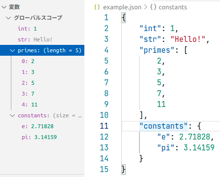

# adapter-json

変数の表示だけを行う DAP アダプタの実装



## 仕様

JSON (.json) ファイルをデバッグする。「起動」すると JSON がパースされて、それがローカル変数の情報であるかのように表示される。

ステップ実行などはできない。

### 例

```json
{
    "message": "hello, world!"
}
```

これは次のような状況を表していると解釈する:

```js
    const message = "hello, world!"
```

## その他

- VSCode 拡張機能の adapter-minimal との相違点:
    - `package.json` に `configurationAttributes` を追加した。
    - これにより `launch.json` で sourceFile プロパティを設定できるようになる。
    - この値は launch リクエストの引数に渡される。
