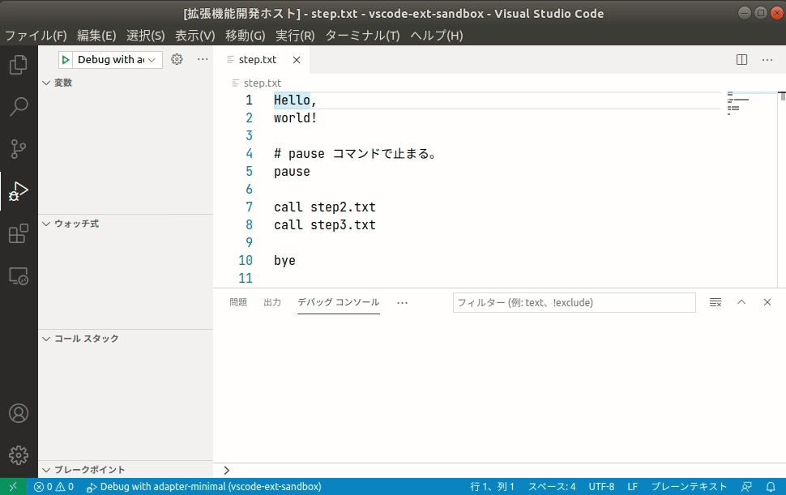

# adapter-step

ステップ実行機能を持つ DAP アダプタの実装

## スクリーンショット



## 仕様

テキストファイル (.txt) をデバッグする。処理は行ごとに行う。

```
# ハッシュで始まる行はコメント。無視される。
```

pause コマンドの行を通ると、そこで中断する。

```
pause
```

call コマンドの行を通ると、指定されたファイルに移動する。そのファイルを処理し終わったら戻ってくる。

```
call ファイルパス
```

その他の行の上を通ると、その内容がデバッガーに送信されて、ログ出力される。

```
Hello
```

## その他

- VSCode 拡張機能の adapter-minimal との相違点:
    - `package.json` に `configurationAttributes` を追加した。
    - これにより `launch.json` で sourceFile プロパティを設定できるようになる。
    - この値は launch リクエストの引数に渡される。
